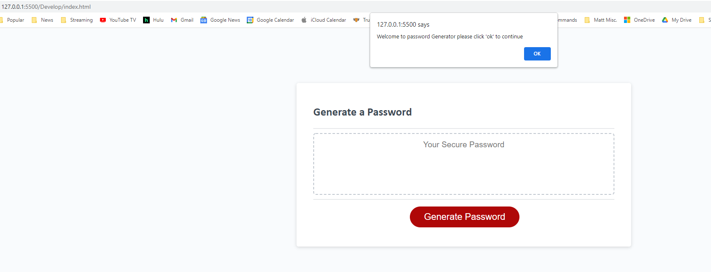
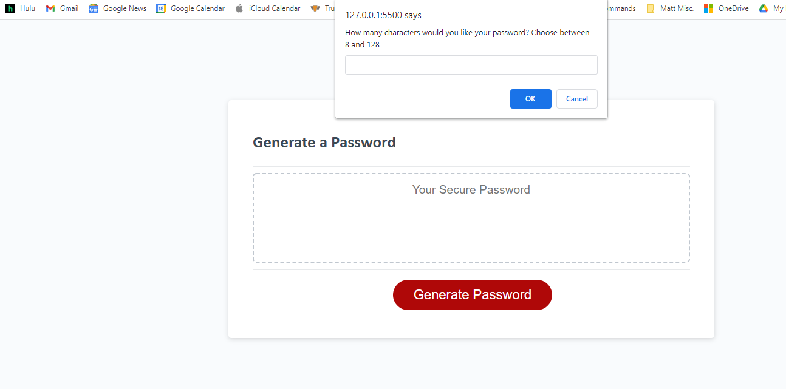

# Password Generator Starter Code

# Challange-3- Password Generator-Matthew McElwee

## Purpose
A website is challange #3 for bootcamp so it is an assignment
It is the start of a password generator that I will use to showcase my development skills.

The purpose is the generate a random password between 8 and 128 characters.  They can have numbers, upper case letters, lower case letters and special characters or any combination as long as 1 is selected.

## Built With
* HTML
* CSS
* JavaScript

## Website

https://mmcelwee8002.github.io/Password-Generator-Challenge-3/

## Contribution
Matthew McElwee
12/19/2021

### Screenshots of Portfolio
  "Image #1");

   "Image #2");

